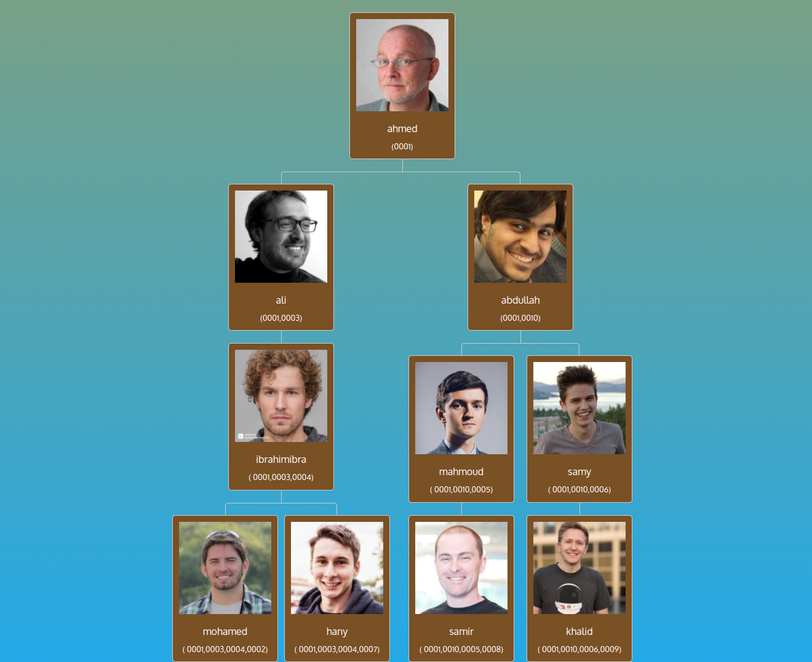

# NgTree

This project was generated with [Angular CLI](https://github.com/angular/angular-cli) version 13.3.0.

## Steps

in `persons-tree.ts` I code my logic to draw the Family Tree Member, I'll Explain it here:
  - first define the jason src, to modifiy it.
  - Mapping on the array , To splite {The Code of members}
  - Then get the numbers of splits codes to collect them into hierarchy array
  - Then Based on The length of code , I arragned it into Tree of arrays 

## The Big Problem I faced

the problem that I had to deal with, Is the Drawing into Template.
I don't like the way that I coded it, because I didn't do it Simple. 
If I have the time, I'll try to code it again by another way. 
  

## Screenshot

  

## Development server

Run `ng serve` for a dev server. Navigate to `http://localhost:4200/`. The application will automatically reload if you change any of the source files.

## Code scaffolding

Run `ng generate component component-name` to generate a new component. You can also use `ng generate directive|pipe|service|class|guard|interface|enum|module`.

## Build

Run `ng build` to build the project. The build artifacts will be stored in the `dist/` directory.

## Running unit tests

Run `ng test` to execute the unit tests via [Karma](https://karma-runner.github.io).

## Running end-to-end tests

Run `ng e2e` to execute the end-to-end tests via a platform of your choice. To use this command, you need to first add a package that implements end-to-end testing capabilities.

